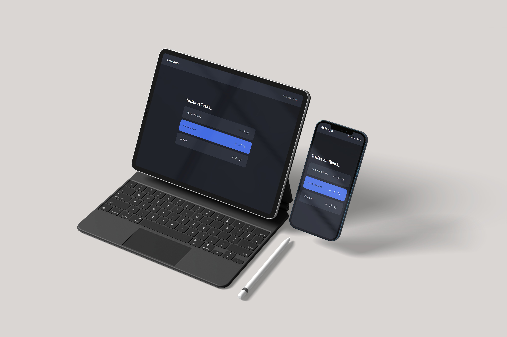

# About
<p>Simple MVC Todo-app. Build with express, mysql, sequelize and handlebars

## Environment variables
- port = server_port_number
- database=database_name
- username=database_user
- password=database_pass
- host=server
- dialect=database

## Install

```bash
$ git clone https://github.com/RubenFontes/simple-financial-system 
```

```bash
$ cd simple-financial-system
```

```bash
$ npm install
```

## Run

```
npm start
```

## License
[GPL](https://choosealicense.com/licenses/gpl-3.0/)