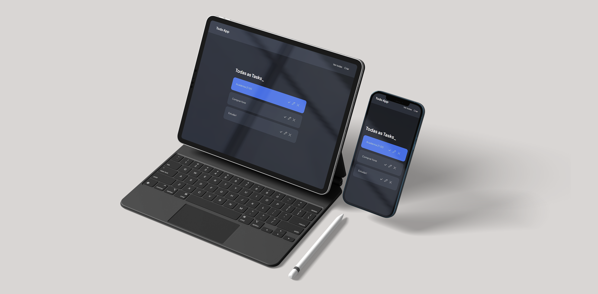

# About
<p>Simple MVC Todo-app. Build with express, mysql, sequelize and handlebars

## Environment variables
- port=server_port_number
- database=database_name
- username=database_user
- password=database_pass
- host=server
- dialect=database

## Build

```bash
$ git clone https://github.com/RubenFontes/todo-app.git
```

```bash
$ cd todo-app
```

```bash
$ npm install
```

## Run

```
npm start
```
## View
  
<server:port/route><br>
<http://localhost:3000/tasks> (default)
  
## Contributing
Pull requests are welcome. For major changes, please open an issue first to discuss what you would like to change.

Please make sure to update tests as appropriate.

## License
[GPL](https://choosealicense.com/licenses/gpl-3.0/)
